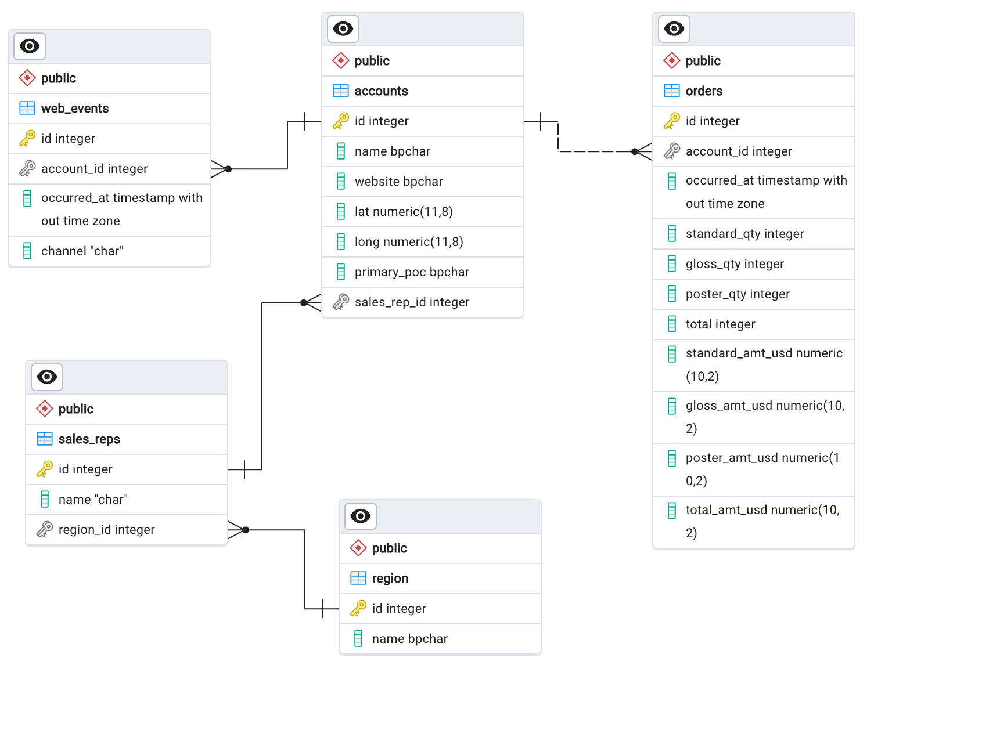

# SQL for Data Analysis

This repository contains the queries designed for the [SQL for Data Analysis](https://www.udacity.com/course/sql-for-data-analysis--ud198) on the Udacity Platform. 
The course focused on:
- Learning to execute core SQL commands to define, select, manipulate, control access to, aggregate, and join data and tables.
- It also provided material to understand when and how to use subqueries, several window functions, and partitions to complete complex tasks.
- Clean data, optimise SQL queries and write advanced JOINs to enhance analysis performance. 

**Notes**
- Most of the queries are executed using the Parch & Posey database (toy datasets).
- The course comprised eight lessons and was completed in 2023. The database schema and the EDR are shown below:

## Query Contents
### L1 Basic SQL
* 1.1-1.7 Intro, Databases, ERD Fundamentals, SQL
* 1.8-1.10 Types of Databases 
* 1.10-1.11 Types of Statements 
* 1.11-1.13 SELECT & FROM
* 1.14 Formatting Best Practices
* 1.15-1.17 LIMIT
* 1.18-1.20 ORDER BY
* 1.21-1.23 ORDERBY Part II
* 1.24-1.26 WHERE
* 1.27-1.29 WHERE with Non-numeric Data
* 1.30-1.32 Arithmetic Operators
* 1.33 Intro to Logical Operators
* 1.34-1.36 LIKE
* 1.37-1.39 IN
* 1.40-1.42 NOT
* 1.43-1.45 AND and BETWEEN
* 1.46-1.48 OR

### L2 Advance Beyond Basics
### L3 SQL JOINS Previous(L2)
* 3.1-3.3 Intro
* 3.4-3.5 JOINs
* 3.6 ERD
* 3.7-3.9 Primary and Foreign Key
* 3.10-317 General JOINs, LEFT & RIGHT
* 3.18-3.20 JOINs & Filtering

### L4 SQL Aggregations
* 4.1 Intro to aggregations
* 4.2 Intro to NULLs
* 4.3 NULLs & Aggregations
* 4.4 COUNT
* 4.5 COUNT & NULLS
* 4.6-4.8 SUM
* 4.9-4.12 MIN, MAX & AVG
* 4.13-4.18 GROUP BY PART 1 & PART II
* 4.19-4.21 DISTINCT
* 4.22-4.24 HAVING
* 4.25-4.28 DATE Functions
* 4.29-4.32 CASE statements & Aggregations

### L5 SQL Subqueries & Temporary Table
* 5.1-5.10 Subqueries & Queries 
* 5.11-5.15 WITH

### L6 SQL Data Cleaning 
* 6.1–6.4 LEFT & RIGHT
* 6.5-6.7 POSITION, STRPOS & SUBSTR
* 6.8-6.10 CONCAT
* 6.11-6.13 CAST
* 6.14-6.16 COALESCE

### L7 Advanced SQL Window Functions
* 7.1 – 7.6 Window Functions
* 7.7 -7.9 ROW_NUMBER & RANK
* 7.10-7.12 Aggregates in Window Functions
* 7.13-7.15 Aliases for Multiple Window Functions
* 7.17-7.18 Comparing a Row to Previous Row
* 7.19-7.22 PERCENTILES
  
### L8 SQL Advanced JOINS & Performance Tuning
* 1-8.4 FULL OUTER JOIN
* 8.5-8.7JOINS with Comparison operators
* 8.8-8.10 Self JOINs
* 8.11-8.13 UNION
* 8.14-8.17 Performance Tuning
* 8.18 JOINing subqueries

